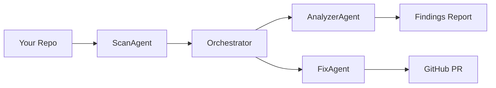

## Overview

When you run a scan, three agents work together to analyse your code and — if you trigger a fix — create a pull request with patches applied.

## The three agents

### Orchestrator

The Orchestrator is the root agent. It receives your project manifest (framework, file list, key files), decides which sub-agents to invoke, and assembles the final response. You never interact with it directly.

### AnalyzerAgent

The AnalyzerAgent runs the 13-rule security checker against your codebase. It produces a structured JSON array of findings — each with a rule ID, severity, file location, description, and auto-fix flag. It also runs the grading algorithm to produce a letter grade (A–F).

On paid plans, the AnalyzerAgent also passes each finding through a language model (Gemini 2.0 Flash) to generate a plain-English remediation plan with code examples.

### FixAgent

The FixAgent is invoked only when you explicitly request fixes (via the dashboard or `unideploy fix`). It takes the findings produced by the AnalyzerAgent, generates file patches using Gemini 2.5 Pro, applies them to a sandboxed clone of your repository, and creates a GitHub pull request via the Composio GitHub integration.

The FixAgent only modifies files and only for findings marked `auto_fixable: true`.

## Where agents run

Agents are deployed on Vertex AI Agent Engine (Google Cloud) and are invoked by the backend API. You do not need a Google Cloud account to use UniDeploy — this is infrastructure that UniDeploy manages on your behalf.

## Sandbox isolation

Code is processed inside an ephemeral sandbox that is destroyed after each session. The FixAgent applies patches to a sandboxed clone, not to your live repository. Changes reach your repo only via a pull request, which you review and merge.
